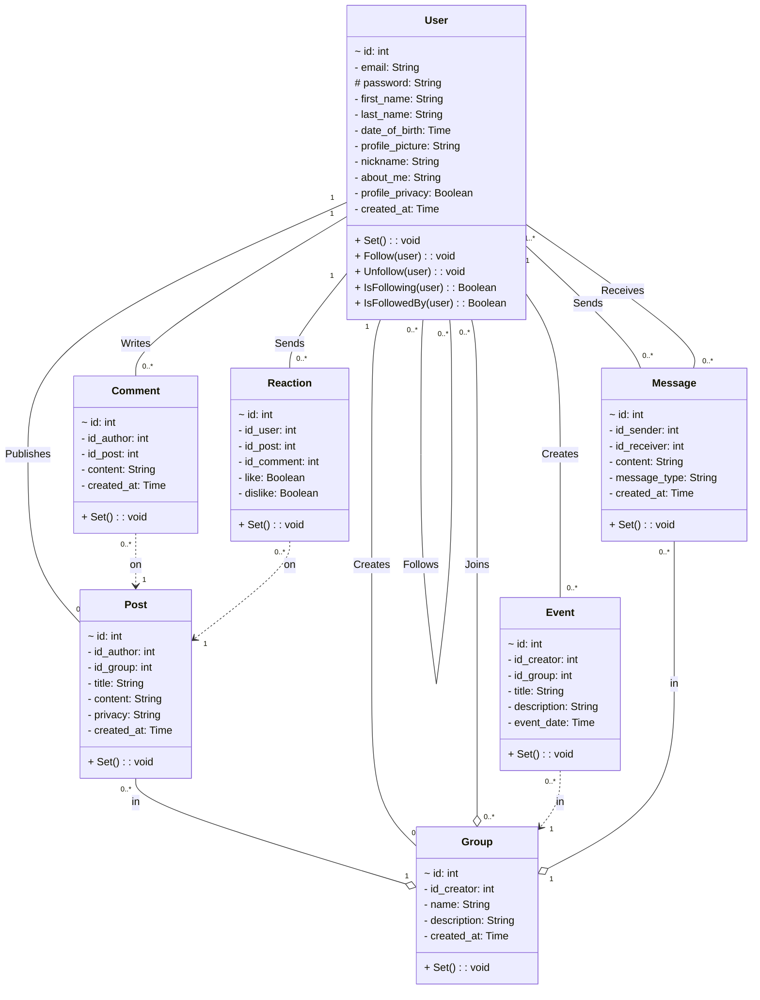
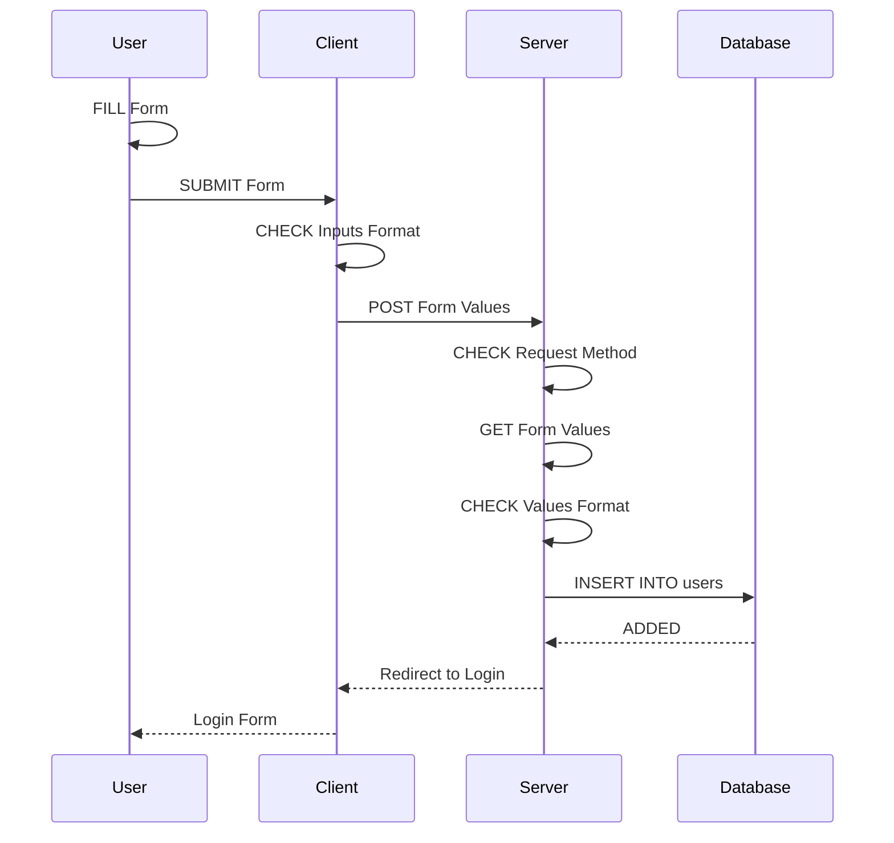
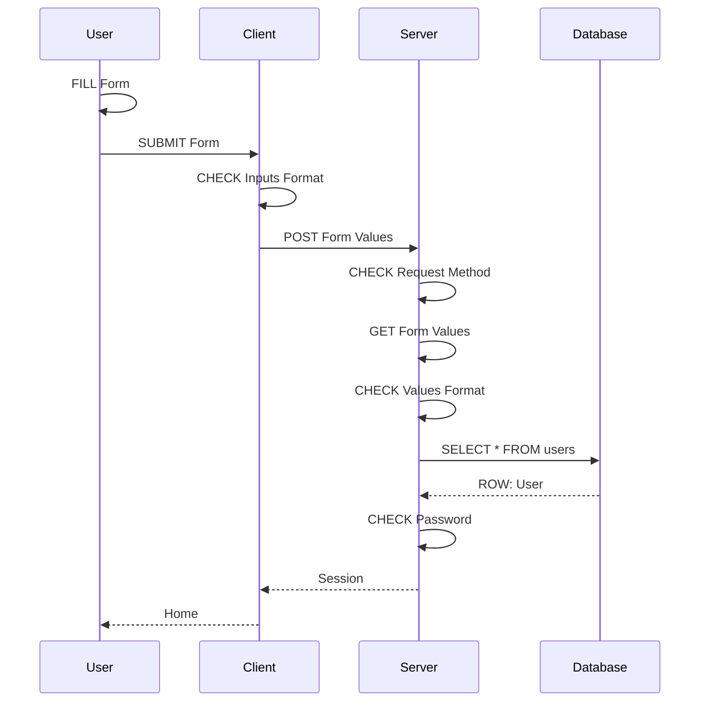
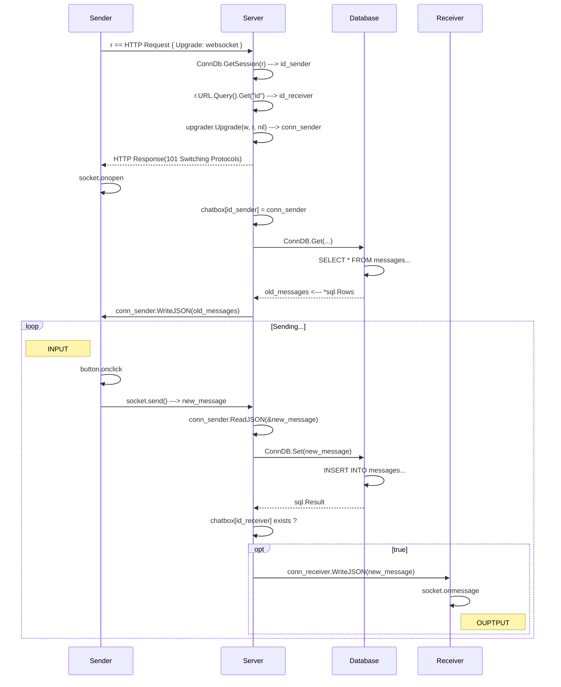

# social-network

## Table of Contents

- [**Description**](#description)
- [**Tech Stack**](#tech-stack)
  - [Front-End](#front-end)
  - [Back-End](#back-end)
  - [Others](#others)
- [**Installation**](#installation)
  - [Cloning](#cloning)
  - [File System](#file-system)
    - [backend/](#backend)
    - [frontend/](#frontend)
- [**Usage**](#usage)
  - [Next.js](#nextjs)
    - [Getting started](#getting-started)
    - [Learn more](#learn-more)
    - [Deploy on Vercel](#deploy-on-vercel)
  - [Go](#go)
  - [Docker Compose](#docker-compose)
    - [Building and running your application](#building-and-running-your-application)
    - [Deploying your application to the cloud](#deploying-your-application-to-the-cloud)
    - [References](#references)
- [**Blueprints**](#blueprints)
  - [Models](#models)
  - [Register](#register)
  - [Login](#login)
  - [Profile](#profile)
  - [Post](#post)
  - [Comment](#comment)
  - [Reaction](#reaction)
  - [Chat](#chat)
  - [Follow](#follow)
  - [Group](#group)
- [**Aknowlegments**](#aknowlegments)
  - [Contributors](#contributors)
  - [Peers](#peers)
  - [Testers](#testers)
  - [Auditors](#auditors)
- [**Sources**](#sources)
- [**License**](#license)

## Description

###### [_Table of Content ⤴️_](#table-of-contents)

## Tech Stack

### Front-End

Click on badges to get to the code...

[]()
[]()
[]()
[]()  
[]()
[]()
[]()
[]()

### Back-End

Click on badges to get to the code...

[]()
[]()
[]()

### Development

[]()
[]()
[]()

### Office

[]()
[]()
[]()

### Others

[](#table-of-contents)

###### [_Table of Content ⤴️_](#table-of-contents)

## Installation

### Cloning

```shell
git clone http://learn.zone01dakar.sn/git/jefaye/social-network.git
cd social-network
```

### File System

    |
    + -- backend/
    |
    + -- frontend/
    |
    + -- .dockerignore
    + -- .gitignore
    + -- audit.todo
    + -- docker-compose.yml
    + -- gitify.sh
    + -- LICENSE
    + -- Makefile
    + -- README.md

#### backend/

    |
    + --- cmd/
    |       |
    |       + --- web/
    |               |
    |               + -- handlers/
    |               |       + -- config.handler.go
    |               |       + -- home.handler.go
    |               |       + -- login.handler.go
    |               |       + -- register.handler.go
    |               |       + -- user.handler.go
    |               |
    |               + -- helpers/
    |               |       + -- client.helper.go
    |               |       + -- config.helper.go
    |               |       + -- server.helper.go
    |               |
    |               + -- middleware/
    |               |       + -- config.middleware.go
    |               |       + -- log.middleware.go
    |               |       + -- panic.middleware.go
    |               |
    |               + -- validators/
    |               |       + -- config.validator.go
    |               |       + -- user.validator.go
    |               |
    |               + -- main.go
    |               + -- routes.go
    |
    + -- database/
    |       |
    |       + -- data/
    |       |       + -- follows.data.sql
    |       |       + -- groups.data.sql
    |       |       + -- posts.data.sql
    |       |       + -- users.data.sql
    |       |
    |       + -- migrations/
    |       |       |
    |       |       + -- sqlite/
    |       |               + -- 000001_create_users_table.down.sql
    |       |               + -- 000001_create_users_table.up.sql
    |       |               + -- 000002_create_posts_table.down.sql
    |       |               + -- 000002_create_posts_table.up.sql
    |       |               + -- 000003_create_comments_table.down.sql
    |       |               + -- 000003_create_comments_table.up.sql
    |       |               + -- 000005_create_messages_table.down.sql
    |       |               + -- 000005_create_messages_table.up.sql
    |       |               + -- 000006_create_post_visibility_table.down.sql
    |       |               + -- 000006_create_post_visibility_table.up.sql
    |       |               + -- 000007_create_reactions_table.down.sql
    |       |               + -- 000007_create_reactions_table.up.sql
    |       |               + -- 000008_create_groups_table.down.sql
    |       |               + -- 000008_create_groups_table.up.sql
    |       |               + -- 000009_create_groups_members_table.up.sql
    |       |               + -- 000010_create_follows_table.down.sql
    |       |               + -- 000010_create_follows_table.up.sql
    |       |               + -- 000011_create_events_table.down.sql
    |       |               + -- 000011_create_events_table.up.sql
    |       |
    |       + -- social-network.db
    |
    + -- internal/
    |       |
    |       + -- models/
    |       |       + -- comment.model.go
    |       |       + -- config.model.go
    |       |       + -- event.model.go
    |       |       + -- follow.model.go
    |       |       + -- group.model.go
    |       |       + -- message.model.go
    |       |       + -- post.model.go
    |       |       + -- reaction.model.go
    |       |       + -- user.model.go
    |       |
    |       + -- utils/
    |               + -- db.manager.go
    |
    + -- backend.Dockerfile
    + -- go.mod
    + -- go.sum

#### frontend/

    |
    + --- app/
    |       |
    |       + -- login/
    |       |       |
    |       |       + -- page.tsx
    |       |
    |       + -- register/
    |       |       |
    |       |       + -- page.tsx
    |       |
    |       + -- favicon.ico
    |       + -- global.css
    |       + -- layout.tsx
    |       + -- page.tsx
    |       + -- securelayout.tsx
    |
    + -- components/
    |       |
    |       + --- ui/
    |               + -- button.tsx
    |               + -- checkbox.tsx
    |               + -- checker.tsx
    |               + -- input.tsx
    |               + -- textarea.tsx
    |
    + --- lib/
    |       |
    |       + -- hooks/
    |       |       + -- useget.ts
    |       |       + -- usepost.ts
    |       |
    |       + -- cookie.ts
    |       + -- utils.ts
    |
    + -- public/
    |       |
    |       + -- upload/
    |       |       + -- ...
    |       |
    |       + -- next.svg
    |       + -- vercel.svg
    |
    + -- .eslintrc.json
    + -- .gitignore
    + -- components.json
    + -- frontend.Dockerfile
    + -- next.config.mjs
    + -- package-lock.json
    + -- package.json
    + -- postcss.config.mjs
    + -- tailwind.config.ts
    + -- tsconfig.json

###### [_Table of Content ⤴️_](#table-of-contents)

## Usage

### Next.js

This is a [Next.js](https://nextjs.org/) project bootstrapped with [`create-next-app`](https://github.com/vercel/next.js/tree/canary/packages/create-next-app).

#### Getting Started

First, run the development server:

```bash
npm run dev
# or
yarn dev
# or
pnpm dev
# or
bun dev
```

Open [http://localhost:3000](http://localhost:3000) with your browser to see the result.

You can start editing the page by modifying `app/page.tsx`. The page auto-updates as you edit the file.

This project uses [`next/font`](https://nextjs.org/docs/basic-features/font-optimization) to automatically optimize and load Inter, a custom Google Font.

#### Learn More

To learn more about Next.js, take a look at the following resources:

- [Next.js Documentation](https://nextjs.org/docs) - learn about Next.js features and API.
- [Learn Next.js](https://nextjs.org/learn) - an interactive Next.js tutorial.

You can check out [the Next.js GitHub repository](https://github.com/vercel/next.js/) - your feedback and contributions are welcome!

#### Deploy on Vercel

The easiest way to deploy your Next.js app is to use the [Vercel Platform](https://vercel.com/new?utm_medium=default-template&filter=next.js&utm_source=create-next-app&utm_campaign=create-next-app-readme) from the creators of Next.js.

Check out our [Next.js deployment documentation](https://nextjs.org/docs/deployment) for more details.

### Go

```shell
cd backend
go run ./cmd/web/.
INFO	16:54:48.394607 server on http://localhost:4000
```

### Docker Compose

#### Building and running your application

When you're ready, start your application by running:

```shell
docker compose up --build
```

Your application will be available at http://localhost:3000.

#### Deploying your application to the cloud

First, build your image, e.g.:

```shell
docker build -t myapp .
```

If your cloud uses a different CPU architecture than your development
machine (e.g., you are on a Mac M1 and your cloud provider is amd64),
you'll want to build the image for that platform, e.g.:

```shell
docker build --platform=linux/amd64 -t myapp .
```

Then, push it to your registry, e.g.

```shell
docker push myregistry.com/myapp
```

Consult Docker's [getting started](https://docs.docker.com/go/get-started-sharing/)
docs for more detail on building and pushing.

#### References

- [Docker's Node.js guide](https://docs.docker.com/language/nodejs/)

###### [_Table of Content ⤴️_](#table-of-contents)

## Blueprints

### Models



<hr style="background: #111">

### Register



<hr style="background: #111">

### Login



<hr style="background: #111">

### Profile

<hr style="background: #111">

### Post

<hr style="background: #111">

### Comment

<hr style="background: #111">

### Reaction

<hr style="background: #111">

### Chat



<hr style="background: #111">

### Follow

<hr style="background: #111">

### Group

###### [_Table of Content ⤴️_](#table-of-contents)

## Aknowlegments

### Contributors

[](http://learn.zone01dakar.sn/git/muciss)
[](http://learn.zone01dakar.sn/git/cnzale)
[](http://learn.zone01dakar.sn/git/mamadbah2)
[](http://learn.zone01dakar.sn/git/belhadjs)
[](http://learn.zone01dakar.sn/git/adiane)
[](http://learn.zone01dakar.sn/git/jefaye)

### Peers

[](http://learn.zone01dakar.sn/git/)

### Testers

[](http://learn.zone01dakar.sn/git/mandaw)
[](http://learn.zone01dakar.sn/git/bindoye)

### Auditors

[](http://learn.zone01dakar.sn/git/)
[](http://learn.zone01dakar.sn/git/)
[](http://learn.zone01dakar.sn/git/)
[](http://learn.zone01dakar.sn/git/)
[](http://learn.zone01dakar.sn/git/)

###### [_Table of Content ⤴️_](#table-of-contents)

## Sources

###### [_Table of Content ⤴️_](#table-of-contents)

## License
