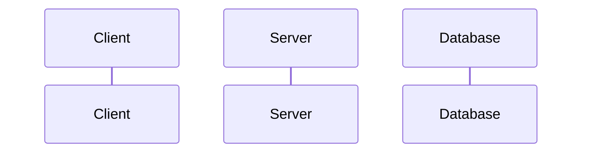
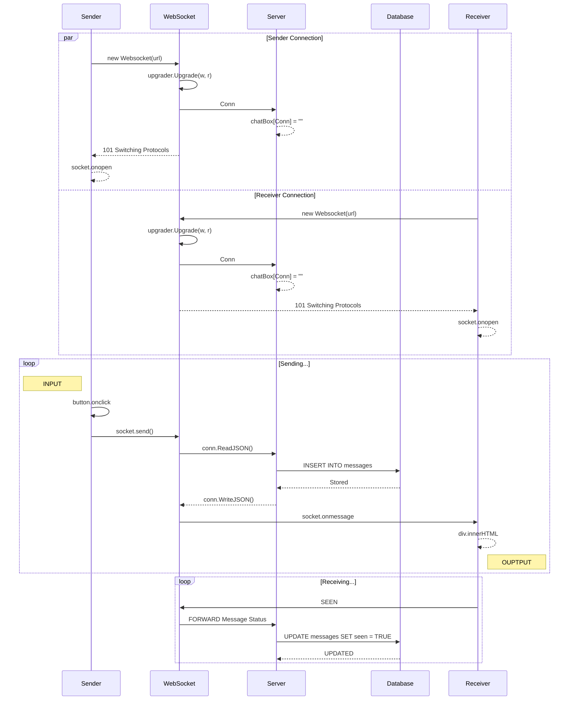

# social-network
You will have a Facebook-like social network

## Table of Contents

- [**Description**](#description)
- [**Tech Stack**](#tech-stack)
    - [Front-End](#front-end)
    - [Back-End](#back-end)
    - [Others](#others)
- [**Installation**](#installation)
    - [Cloning](#cloning)
    - [File System](#file-system)
        - [backend/](#backend)
        - [frontend/](#frontend)
    - [Running](#running)
- [**Usage**](#usage)
    - [Register](#register)
    - [Login](#login)
    - [Profile](#profile)
    - [Post](#post)
    - [Comment](#comment)
    - [Reaction](#reaction)
    - [Chat](#chat)
    - [Follow](#follow)
    - [Group](#group)
- [**Aknowlegments**](#aknowlegments)
    - [Contributors](#contributors)
    - [Peers](#peers)
    - [Testers](#testers)
    - [Auditors](#auditors)
- [**Sources**](#sources)
- [**License**](#license)

## Description

###### [*Table of Content ⤴️*](#table-of-contents)

## Tech Stack

### Front-End

Click on badges to get to the code...

[]()
[]()
[]()
[]()
[]()

### Back-End

Click on badges to get to the code...

[]()
[]()

### Others

[]()
[]()
[](#table-of-contents)
[]()
[]()
[]()

###### [*Table of Content ⤴️*](#table-of-contents)

## Installation

### Cloning

```shell
git clone http://learn.zone01dakar.sn/git/jefaye/social-network.git
cd social-network
```

### File System

    |
    + -- backend/
    |       |
    |       + --- cmd/web/
    |       |
    |       + -- database/
    |       |
    |       + -- internal/
    |
    + -- frontend/static/upload/
    |
    + -- .dockerignore
    + -- .gitignore
    + -- docker-compose.yml
    + -- Makefile
    + -- README.md


#### backend/

    |
    + --- cmd/
    |       |
    |       + --- web/
    |               |
    |               + -- handlers/
    |               |       + -- config.handler.go
    |               |       + -- home.handler.go
    |               |       + -- login.handler.go
    |               |       + -- register.handler.go
    |               |       + -- user.handler.go
    |               |
    |               + -- helpers/
    |               |       + -- client.helper.go
    |               |       + -- config.helper.go
    |               |       + -- server.helper.go
    |               |
    |               + -- middleware/
    |               |       + -- config.middleware.go
    |               |       + -- log.middleware.go
    |               |       + -- panic.middleware.go
    |               |
    |               + -- validators/
    |               |       + -- config.validator.go
    |               |       + -- user.validator.go
    |               |
    |               + -- main.go
    |               + -- routes.go
    |
    + -- database/
    |       |
    |       + -- datas/
    |       |       + -- follows.data.sql
    |       |       + -- groups.data.sql
    |       |       + -- posts.data.sql
    |       |       + -- users.data.sql
    |       |
    |       + -- migrations/
    |       |       |
    |       |       + -- sqlite/
    |       |               + -- 000001_create_users_table.down.sql
    |       |               + -- 000001_create_users_table.up.sql
    |       |               + -- 000002_create_posts_table.down.sql
    |       |               + -- 000002_create_posts_table.up.sql
    |       |               + -- 000003_create_comments_table.down.sql
    |       |               + -- 000003_create_comments_table.up.sql
    |       |               + -- 000005_create_messages_table.down.sql
    |       |               + -- 000005_create_messages_table.up.sql
    |       |               + -- 000006_create_post_visibility_table.down.sql
    |       |               + -- 000006_create_post_visibility_table.up.sql
    |       |               + -- 000007_create_reactions_table.down.sql
    |       |               + -- 000007_create_reactions_table.up.sql
    |       |               + -- 000008_create_groups_table.down.sql
    |       |               + -- 000008_create_groups_table.up.sql
    |       |               + -- 000009_create_groups_members_table.up.sql
    |       |               + -- 000010_create_follows_table.down.sql
    |       |               + -- 000010_create_follows_table.up.sql
    |       |               + -- 000011_create_events_table.down.sql
    |       |               + -- 000011_create_events_table.up.sql
    |       |
    |       + -- social-network.db
    |
    + -- internal/
    |       |
    |       + -- models/
    |       |       + -- comment.model.go
    |       |       + -- config.model.go
    |       |       + -- event.model.go
    |       |       + -- follow.model.go
    |       |       + -- group.model.go
    |       |       + -- message.model.go
    |       |       + -- post.model.go
    |       |       + -- reaction.model.go
    |       |       + -- user.model.go
    |       |
    |       + -- utils/
    |               + -- db.manager.go
    |
    + -- backend.Dockerfile
    + -- go.mod
    + -- go.sum
    

#### frontend/

    |
    + -- static/
    |       |
    |       + -- upload/
    |               + -- ...
    |
    + -- frontend.Dockerfile

### Running

```shell
go run .
```

###### [*Table of Content ⤴️*](#table-of-contents)

## Usage


<hr style="background: #111">

### Register


<hr style="background: #111">

### Login


<hr style="background: #111">

### Profile



<hr style="background: #111">

### Post


<hr style="background: #111">

### Comment


<hr style="background: #111">

### Reaction


<hr style="background: #111">

### Chat



<hr style="background: #111">

### Follow


<hr style="background: #111">

### Group


###### [*Table of Content ⤴️*](#table-of-contents)

## Aknowlegments

### Contributors

[]()
[]()
[]()
[]()
[]()
[]()

### Peers

[]()

### Testers

[]()

### Auditors

[]()
[]()
[]()
[]()
[]()

###### [*Table of Content ⤴️*](#table-of-contents)

## Sources

###### [*Table of Content ⤴️*](#table-of-contents)

## License